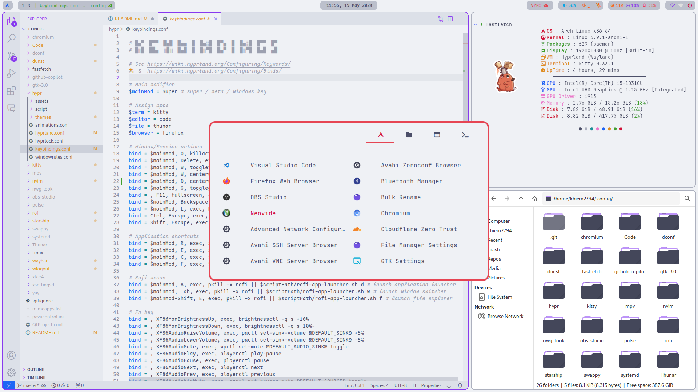
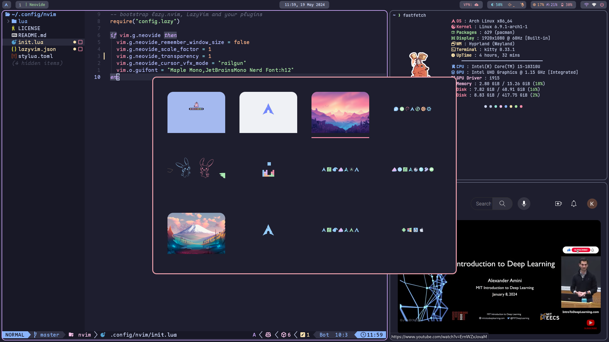

<h1 align=center>Arch Linux Dotfiles</h1>

<div align="center">
<a href="#setting-up-starter">Starter</a> - <a href="#setting-up-essential">Essential</a> - <a href="#resolving-issues">Issues</a> - <a href="#setting-up-optional">Optional</a>
</div>


<h2>Themes</h2>

- **Latte**



- **Mocha**




---

<h2 id="setting-up-starter">1. Setting up starter</h2>

<details>
<summary><b>Archinstall & reboot</b></summary>

- Extra packages: neovim sudo git
- Partition: /boot, /, /home
- Bootloader: grub
- Type: Minimal
- Audio: pipewire
</details>


<details>
  <summary><b>Installing starter packages</b></summary>

  ```bash
    nmtui # use to connect wifi

    # Installing essential packages
    sudo pacman -S wget unzip polkit-gnome pacman-contrib lazygit
    sudo pacman -S udiskie
    sudo pacman -S brightnessctl 
    sudo pacman -S pavucontrol pamixer
    sudo pacman -S network-manager-applet nm-connection-editor bluez bluez-utils blueman

    # Installing yay + cloning dotfiles
    mkdir Repos && cd Repos
    git clone https://github.com/khiem2794/dotfiles
    git clone https://aur.archlinux.org/yay.git
    cd yay
    makepkg -si

    # Installing themes, fonts & cursor
    yay -S tela-circle-icon-theme-dracula catppuccin-gtk-theme-mocha catppuccin-gtk-theme-latte bibata-cursor-theme-bin ttf-maple
    sudo pacman -S ttf-jetbrains-mono-nerd 

    # Installing hyprland, hyprlock & kitty
    sudo pacman -S hyprland hyprlock kitty xdg-desktop-portal-hyprland
    rm -rf ~/.config/hypr
    cp -r ~/Repos/dotfiles/hypr ~/.config/
    cp -r ~/Repos/dotfiles/kitty ~/.config/
    Hyprland #Super + R after to start kitty
  ```

</details>

<h2 id="setting-up-essential">2. Setting up essential packages</h2>

<details>
  <summary><b>Installing FastFetch</b></summary>

  ```bash
    sudo pacman -S fastfetch imagemagick
    cp -r ~/Repos/dotfiles/fastfetch ~/.config/
  ```

</details>

<details>
  <summary><b>Installing Thunar file browser (Super + E)</b></summary>

  ```bash
    sudo pacman -S thunar gvfs tumbler
  ```

</details>

<details>
  <summary><b>Installing VSCode (Super + C)</b></summary>

  ```bash
    yay -S visual-studio-code-bin
    code --install-extension Catppuccin.catppuccin-vsc
    cp -r ~/Repos/dotfiles/Code ~/.config/
  ```

</details>

<details>
  <summary><b>Installing Firefox (Super + F)</b></summary>

- Enable toolkit.legacyUserProfileCustomizations.stylesheets
- Copy <https://gist.github.com/khiem2794/4c8cd1e43c5bdf6c630cc314c55201e9>

  ```bash
    sudo pacman -S firefox
  ```

</details>

<details>
  <summary><b>Installing Waybar</b></summary>

  ```bash
    sudo pacman -S waybar
    rm -rf ~/.config/waybar
    cp -r ~/Repos/dotfiles/waybar ~/.config/
  ```

</details>

<details>
  <summary><b>Installing Dunst</b></summary>

  ```bash
    sudo pacman -S dunst libnotify
    cp -r ~/Repos/dotfiles/dunst ~/.config/
  ```

</details>

<details>
  <summary><b>Installing Rofi (Super + A)</b></summary>

  ```bash
    yay -S rofi-lbonn-wayland-git
    cp -r ~/Repos/dotfiles/rofi ~/.config/
  ```

</details>

<details>
  <summary><b>Installing Wlogout (Super + [Shift] + Backspace)</b></summary>

  ```bash
    yay -S wlogout
    cp -r ~/Repos/dotfiles/wlogout ~/.config/
  ```

</details>

<details>
  <summary><b>Installing Swww</b></summary>

  ```bash
    yay -S swww
    mkdir ~/Pictures
    mkdir ~/Pictures/Wallpapers #Download and put wallpapers here
  ```

</details>

<details>
  <summary><b>Installing Warp VPN</b></summary>

  ```bash
    yay -S cloudflare-warp-bin 
    sudo systemctl enable warp-svc
    sudo systemctl start warp-svc
    warp-cli register
    warp-cli connect
  ```

</details>

<details>
  <summary><b>Installing + Config Starship prompt</b></summary>

  ```bash
  sudo pacman -S starship
  echo "export STARSHIP_CONFIG=~/.config/starship/starship.toml" >> ~/.bashrc
  echo "eval \"\$(starship init bash)\"" >> ~/.bashrc
  rm ~/.config/starship.toml
  cp -r ~/Repos/dotfiles/starship ~/.config/
  ```

</details>

<details>
  <summary><b>Installing Tmux</b></summary>

  ```bash
    sudo pacman -S tmux
    cp -r ~/Repos/dotfiles/tmux ~/.config/
  ```

</details>

<details>
  <summary><b>Updating grub settings</b></summary>

  ```bash
    sudo nvim /etc/defaut/grub
    sudo grub-mkconfig -o /boot/grub/grub.cfg
  ```

</details>

<details>
  <summary><b>Installing rust + nvm</b></summary>

  ```bash
    curl --proto '=https' --tlsv1.2 -sSf https://sh.rustup.rs | sh
    curl -o- https://raw.githubusercontent.com/nvm-sh/nvm/v0.39.7/install.sh | bash
    nvm install --lts
  ```

</details>

<details>
  <summary><b>Config neovim + install neovide</b></summary>

  ```bash
    git clone https://github.com/khiem2794/nvim-config ~/.config/nvim
    sudo pacman -S neovide
  ```

</details>

<details>
  <summary><b>Installing screenshot tools (Super + P)</b></summary>

  ```bash
    sudo pacman -S slurp swappy cliphist
    yay -S grimblast-git
  ```

</details>

<details>
  <summary><b>Installing nwg-look</b></summary>

  ```bash
    sudo pacman -S nwg-look
    nwg-look
  ```

</details>

<details>
  <summary><b>Installing + Config SDDM</b></summary>

  ```bash
    sudo pacman -S sddm
    yay -S sddm-theme-corners-git
    sudo cp /usr/lib/sddm/sddm.conf.d/default.conf /etc/sddm.conf
    sudo nvim /etc/sddm.conf #change theme to corners
    sudo nvim /usr/share/sddm/themes/corners/theme.conf #change background + remove avatar
    sudo systemctl enable sddm
    sudo systemctl start sddm
  ```

</details>

<details>
  <summary><b>Installing TimeShift & Backup</b></summary>

  ```bash
    sudo pacman -S timeshift
    sudo -E timeshift-launcher
    sudo nvim /usr/share/applications/timeshift-gtk.desktop #fixing launcher
  ```

</details>

<h2 id="resolving-issues">3. Resolve issues might happen</h2>

<details>
  <summary><b>Cursor theme not consistent</b></summary>

  Checking <https://wiki.archlinux.org/title/Cursor_themes#Configuration> and apply system-wide change.
  ```bash
    mkdir ~/.local/share/icons
    ln --symbolic /usr/share/icons/Bibata-Modern-Ice/ ~/.local/share/icons/default
  ```

</details>

<h2 id="setting-up-optional">4. Optional softwares & packages</h2>

<details>
  <summary><b>Chromium</b></summary>

  ```bash
    sudo pacman -S chromium
    chromium --app=https://chat.openai.com
  ```

</details>

<details>
  <summary><b>Image viewer imv and Media player mpv</b></summary>

  ```bash
    sudo pacman -S imv mpv
  ```

</details>

<details>
  <summary><b>Obs studio - recorder</b></summary>

  ```bash
    sudo pacman -S obs-studio
  ```

</details>

<details>
  <summary><b>Pdf reader</b></summary>
</details>

<details>
  <summary><b>Image galery</b></summary>
</details>
