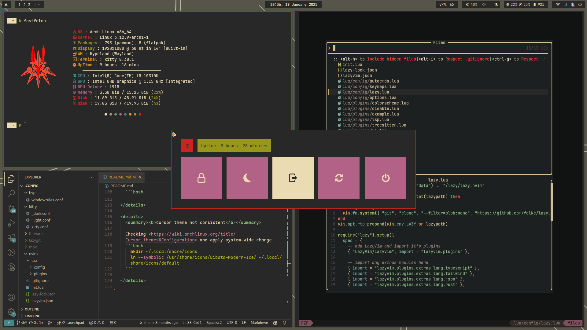
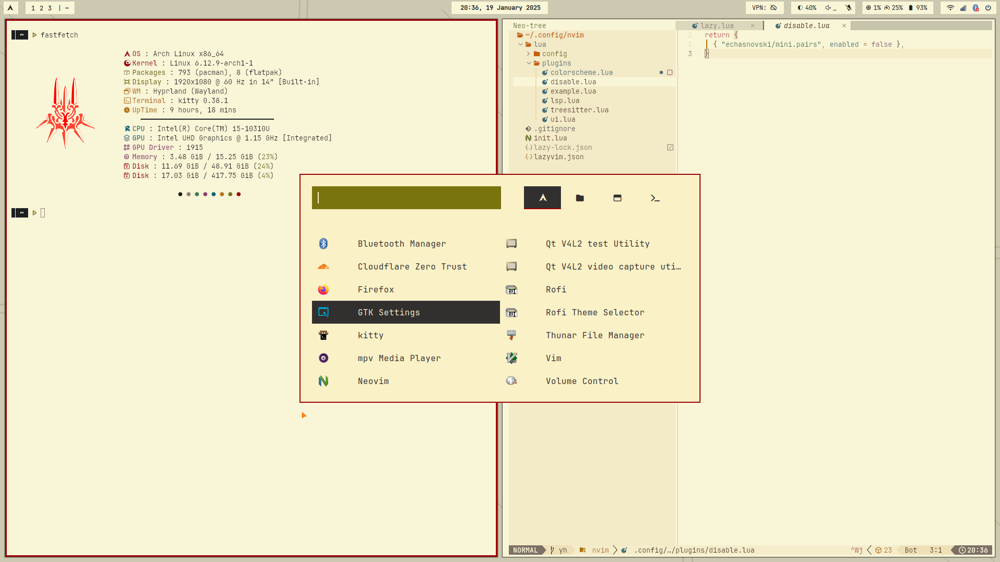

<h1 align=center>Arch Linux Dotfiles</h1>

<div align="center">
<a href="#setting-up-starter">Starter</a> - <a href="#setting-up-essential">Essential</a> - <a href="#resolving-issues">Issues</a>
</div>


<h2>Themes</h2>

- **Dark**



- **Light**




---

<h2 id="setting-up-starter">1. Starting packages</h2>

  ```bash
    # Installing essential packages
    sudo pacman -S wget unzip polkit-gnome pacman-contrib git neovim
    sudo pacman -S udiskie
    sudo pacman -S brightnessctl 
    sudo pacman -S pavucontrol pamixer
    sudo pacman -S network-manager-applet nm-connection-editor
    sudo pacman -S bluez bluez-utils blueman

    # Installing yay
    mkdir Repos && cd Repos
    git clone https://aur.archlinux.org/yay.git
    cd yay
    makepkg -si

    # Installing hyprland & fonts, themes
    yay -S  bibata-cursor-theme-bin ttf-maple
    sudo pacman -S hyprland hyprlock hyprpaper kitty ttf-jetbrains-mono-nerd xdg-desktop-portal-hyprland
  ```

<h2 id="setting-up-essential">2. Setting up essential packages & softwares</h2>


  ```bash
    sudo pacman -S lazygit
    
    sudo pacman -S fastfetch imagemagick
    
    sudo pacman -S thunar gvfs tumbler ffmpegthumbnailer
    
    yay -S visual-studio-code-bin
    code --install-extension jdinhlife.gruvbox
    
    sudo pacman -S firefox #https://github.com/MrOtherGuy/firefox-csshacks/blob/master/chrome/autohide_bookmarks_and_main_toolbars.css

    sudo pacman -S waybar

    yay -S rofi-lbonn-wayland-git

    sudo pacman -S starship
    echo "export STARSHIP_CONFIG=~/.config/starship/starship.toml" >> ~/.bashrc
    echo "eval \"\$(starship init bash)\"" >> ~/.bashrc
    rm ~/.config/starship.toml

    sudo pacman -S tmux
    
    sudo pacman -S slurp swappy cliphist
    yay -S grimblast-git

    sudo pacman -S nwg-look
    
    sudo pacman -S timeshift
    sudo -E timeshift-launcher
    sudo nvim /usr/share/applications/timeshift-gtk.desktop #fixing launcher
    
    curl --proto '=https' --tlsv1.2 -sSf https://sh.rustup.rs | sh
    
    yay -S  zathura-git zathura-pdf-mupdf-git
    
    sudo pacman -S imv mpv
  ```

<details>
  <summary><b>Setting up Warp VPN</b></summary>

  ```bash
    yay -S cloudflare-warp-bin 
    sudo systemctl enable warp-svc
    sudo systemctl start warp-svc
    warp-cli register
    warp-cli connect
  ```

</details>


<h2 id="resolving-issues">3. Resolve issues might happen</h2>

<details>
  <summary><b>NVIDIA gpu</b></summary>

  - Checking out <https://wiki.hyprland.org/Nvidia/>.
  - Modify "MODULES=(nvidia nvidia_modeset nvidia_uvm nvidia_drm)" in /etc/mkinitcpio.conf.
  - Add "nvidia_drm.modeset=1" in GRUB_CMDLINE_LINUX_DEFAULT and run grub-mkconfig.
  - Add "source = ~/.config/hypr/nvidia.conf" in hyprland.conf
  ```bash
    yay -S linux-headers nvidia-dkms qt5-wayland qt5ct libva libva-nvidia-driver-git
    
  ```

</details>

<details>
  <summary><b>Cursor theme not consistent</b></summary>

  Checking <https://wiki.archlinux.org/title/Cursor_themes#Configuration> and apply system-wide change.
  ```bash
    mkdir ~/.local/share/icons
    ln --symbolic /usr/share/icons/Bibata-Modern-Ice/ ~/.local/share/icons/default
  ```

</details>
